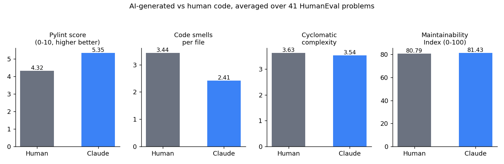

# AI-Generated Code Quality Benchmark

**Research question:** when an AI assistant and a human both write a correct
solution to the same well-specified problem, do their solutions differ in
code quality, complexity, and maintainability, the properties that drive
technical debt?

This is a small, fully reproducible pipeline that runs static-analysis tools
(Pylint, Radon) over matched pairs of human-written and AI-written Python
solutions to the same problems, and reports the differences. It is a scaled-down
demonstration of the measurement approach used in my PhD research on technical
debt in AI-assisted software development.

## Result summary (41 HumanEval problems)

| Metric | Human (canonical) | Claude-generated | Difference |
|---|---|---|---|
| Correctness (pass official tests) | 41/41 (100%) | 39/41 (95.1%) | -2 |
| Pylint score (0-10, higher = fewer issues) | 4.32 | 5.35 | +1.03 |
| Code smells per file | 3.44 | 2.41 | -1.02 |
| Cyclomatic complexity (max per file) | 3.63 | 3.54 | -0.10 |
| Maintainability Index (Radon, 0-100) | 80.79 | 81.43 | +0.64 |
| Source lines of code | 7.37 | 7.12 | -0.24 |



Full per-problem breakdown: [`results/REPORT.md`](results/REPORT.md). Raw
data: [`results/metrics.csv`](results/metrics.csv) and
[`results/correctness.json`](results/correctness.json).

## Reading these results

On this sample, Claude-generated solutions score slightly *better* on Pylint
and have fewer flagged code smells, while complexity, maintainability index,
and line count are roughly comparable to the human reference solutions. Two
of the 41 generated solutions fail the official test suite on edge cases
(`HumanEval/84`, `HumanEval/140`), which static analysis alone does not catch,
underscoring why correctness and quality need to be measured separately.

These results should **not** be read as "AI code has no technical debt."
HumanEval problems are short, self-contained, and well-specified, which is the
setting where current models perform best. The interesting open question, and
the one my PhD work addresses at scale, is what happens in large, messy,
real-world repositories with cross-file dependencies, legacy conventions, and
incomplete specifications, where most accumulated technical debt actually
lives. This repo is a template for that kind of study at a scale anyone can
run in a few minutes.

## Repository structure

```
data/subset.json          41 HumanEval problems (every 4th task, IDs 0-160)
solutions/human/           canonical (human-written) reference solutions
solutions/claude/           Claude-generated solutions to the same prompts
scripts/
  check_correctness.py     runs official HumanEval tests against both sets
  run_static_analysis.py    runs Pylint + Radon over both sets
  build_report.py            aggregates results into results/REPORT.md
  make_chart.py              generates results/comparison.png
  generate_solutions.py      (optional) generate a new solution set via the
                              Anthropic API, for reproducing this with other
                              models or larger samples
results/
  correctness.json
  metrics.csv
  REPORT.md
  comparison.png
```

## Reproducing

```bash
pip install -r requirements.txt
python scripts/check_correctness.py
python scripts/run_static_analysis.py
python scripts/build_report.py
python scripts/make_chart.py
```

To regenerate the AI solution set with a different model (requires an
Anthropic API key):

```bash
export ANTHROPIC_API_KEY=sk-ant-...
python scripts/generate_solutions.py --model claude-sonnet-4-6 --out solutions/my_model
```

then point `check_correctness.py` / `run_static_analysis.py` at the new
directory (edit the `group` list at the top of each script).

## Methodology notes

- **Problem set:** [HumanEval](https://github.com/openai/human-eval) (Chen et
  al., 2021), every 4th of the 164 tasks, for a spread across difficulty and
  topic without hand-picking.
- **Human baseline:** the canonical reference solutions distributed with
  HumanEval, written by the benchmark's authors.
- **AI solutions:** written directly by Claude given the same function
  signature and docstring as the human baseline, with no extra prompting,
  hints, or retries. This matches how a developer typically receives
  AI-generated code, a single completion, used as-is.
- **Correctness:** each solution is run against HumanEval's own unit tests in
  an isolated subprocess.
- **Code quality:** Pylint (default checks) for code smells and an overall
  0-10 score, and Radon for cyclomatic complexity and the Maintainability
  Index.

## Relation to my PhD research

My dissertation work measures whether AI coding assistants increase technical
debt in real open-source repositories, using a five-stage static-analysis
pipeline (Prospector, Pylint, Radon, SonarQube, SciTools Understand) and the
SQALE model to estimate the cost of that debt in developer-hours. This repo
applies the same family of tools at a scale anyone can run, on a public
benchmark, as a transparent and reproducible starting point.

## License

MIT. See [LICENSE](LICENSE).
